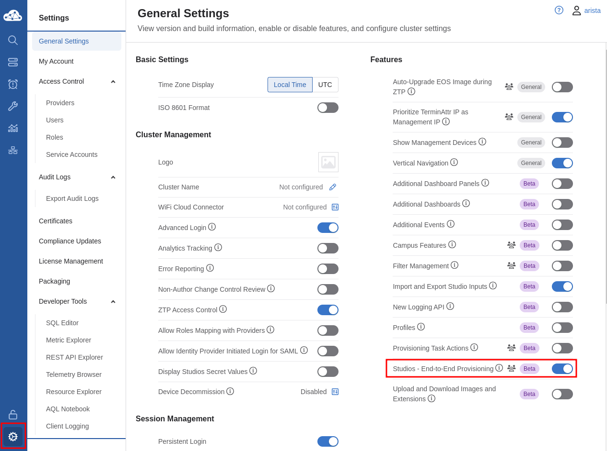

# AVD with Ansible Automation Platform

This guide leverages the [AVD with Ansible Automation Platform (AAP) guide](https://avd.arista.com/stable/docs/getting-started/avd-aap.html) on avd.arista.com as a base to get AVD running with AAP. You may leverage this repository as your base configuration but modify it to fit your needs.

## Fork the repository

If you would like to use this repository, please [fork](https://github.com/arista-netdevops-community/atd-avd/fork) it and make the required changes.

## Update links and credentials

In the `inventory.yml` file, update the `user_pass` credential for the unique credential assigned to your lab topology. Make sure also to uncomment the `user_pass` variable.

```yaml
  vars:
    ansible_user: arista
    ansible_password: "{{ user_pass | arista.avd.default(lookup('env', 'LABPASSPHRASE')) }}"
    # user_pass: <Enter lab password here>
```

In the `aap-cv-deploy.yml` file, update the `cv_server` variable to the URL for your lab instance.

```yaml
    - name: Provision CV with AVD configuration
      import_role:
        name: cv_deploy
      vars:
        cv_server: # Update lab CV URL  ex, example1.topo.testdrive.arista.com
        cv_token: "{{ lab_token }}"
        cv_run_change_control: true
```

> Please note that the `lab_token` variable will be inherited by our survey secret defined within AAP.


## Enable end-to-end provisioning

Click on settings on the lower left of the main pane and enable "Studios - End-to-End Provisioning."



## Build and deploy

Now, everything is ready to provision your network with AAP and AVD. Feel free to follow the AAP guide on [avd.arista.com](https://avd.arista.com/stable/docs/getting-started/avd-aap.html) and explore any day two actions on the [AVD with ATD guide](./DEMO.md#5-update-underlay-routing-protocol).
