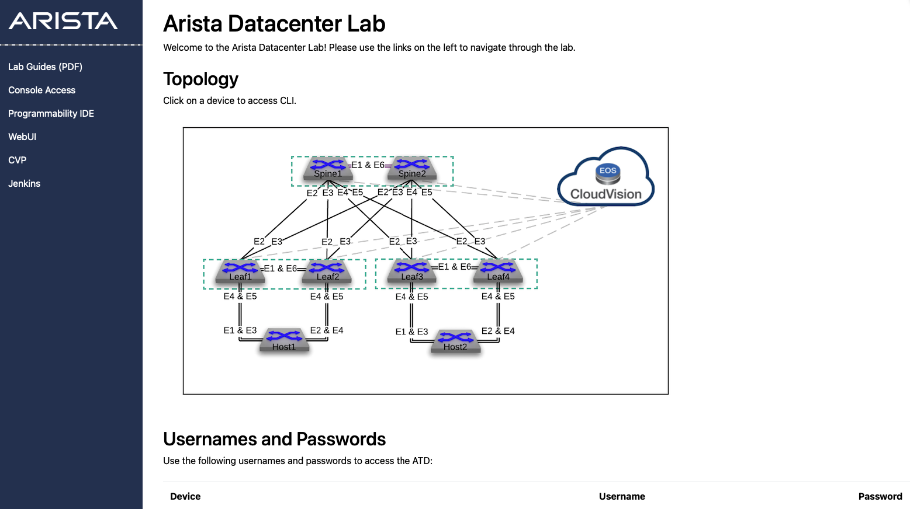
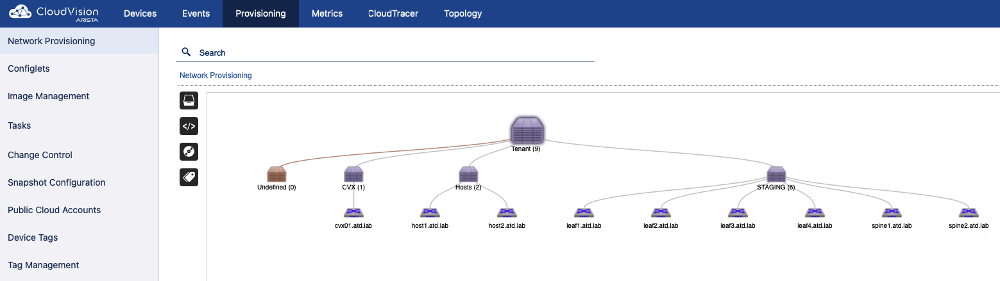
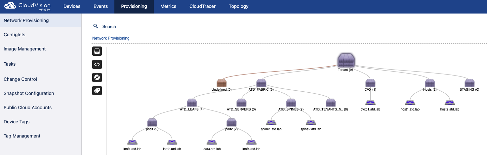

# AVD with Arista Test Drive

## 1. Connect to GUI VM

In your ATD interface, click on __Programmability IDE__ and use the password listed on your lab topology.

> __Note:__ Unique password is auto-generated for each lab instance.



In addition, open CloudVision Portal (CVP) by clicking the __CVP__ link. Then, log in with the username `arista` and the auto-generated password on the lab topology screen.

## 2. Configure your credential

Because the password is auto-generated, you must update the `ansible_password` variable. We will read a configuration file to set our credential file as an environment variable.

Run the following commands from the Programmability IDE terminal:

```shell
export LABPASSPHRASE=`cat /home/coder/.config/code-server/config.yaml| grep "password:" | awk '{print $2}'`
```

## 3. Install all the requirements

The code block below performs the following actions:

- Moves to the `labfiles` directory
- Installs version 4.10.0 of the arista.avd collection
- Installs PyAVD 4.10.0 and arista.avd Ansible collection Python requirements.
- Clones this repository
- Moves to the cloned repository folder

     > :warning: __Warning:__ Specific for the ATD environment. the `pip config` lines disable PIP safety checks and should not be used outside of ATD without understanding them.

    ```shell
    cd /home/coder/project/labfiles
    export LABPASSPHRASE=`cat /home/coder/.config/code-server/config.yaml| grep "password:" | awk '{print $2}'`
    ansible-galaxy collection install arista.avd:==4.10.0
    pip3 config set global.break-system-packages true
    pip3 config set global.disable-pip-version-check true
    pip install "pyavd[ansible]==4.10.0"
    git clone https://github.com/arista-netdevops-community/atd-avd.git
    cd atd-avd
    ```

## 4. Prepare ATD

To emulate a ZTP environment, we will move all devices from their current containers to a dedicated one named `STAGING` to mimic an `undefined` container.

```bash
ansible-playbook playbooks/atd-prepare-lab.yml
```

- This playbook executes the following tasks:
  - Recreates the container topology in staging format
  - Moves nodes to the appropriate container
  - Executes pending tasks for the user on CVP
- Provisioning topology view should be similar to below

  

## 4. Apply AVD configuration

While the playbook supports build/provision/execute in one sequence, we will proceed step-by-step.

### Build device configurations and documentation files

```bash
ansible-playbook playbooks/atd-fabric-build.yml
```

You can review the generated output in your VScode instance:

- EOS Configuration: [atd-inventory/intended/configs](atd-inventory/intended/configs)
- Fabric documentation: [atd-inventory/documentation](atd-inventory/documentation)

### Provision CVP

```bash
ansible-playbook playbooks/atd-fabric-provision.yml
```

This playbook creates the following:

- A new containers topology to support AVD devices based on inventory file
- Move devices to their respective container
- Create configlet per device and bind to devices

Change control remains on the user's side as it's a safer approach for production. We have the option to execute tasks automatically on CloudVision as well.

> Create the change control and execute all pending tasks.



## 5. Update underlay routing protocol

By default, AVD leverages EBGP for the underlay and overlay. However, these settings can be easily modified to fit your environment. For example, if you would like to deploy OSPF as the underlay, update the [ATD_FABRIC.yml](atd-inventory/group_vars/ATD_FABRIC.yml) file by uncommenting the `underlay_routing_protocol: OSPF` variable.

```yaml
...
underlay_routing_protocol: OSPF

...
# bgp peer groups passwords
bgp_peer_groups:
  ipv4_underlay_peers:
...
```

You can rerun the build and provision playbooks to build and provision simultaneously. Remember to create a change control to finalize the deployment on the EOS nodes.

```bash
ansible-playbook playbooks/atd-fabric-build.yml
ansible-playbook playbooks/atd-fabric-provision.yml
```

## 6. Add a new tenant to the fabric

Edit the [ATD_TENANTS_NETWORKS.yml](atd-inventory/group_vars/ATD_TENANTS_NETWORKS.yml) file and uncomment `Tenant_B` before running the playbook.

```yaml
# edit atd-inventory/group_vars/ATD_TENANTS_NETWORKS.yml
tenants:
  # Tenant A Specific Information - VRFs / VLANs
  - name: Tenant_A:
  ...

  - name: Tenant_B
    mac_vrf_vni_base: 20000
    vrfs:
      - name: Tenant_B_OP_Zone
        vrf_vni: 20
        svis:
          - id: 210
            name: Tenant_B_OP_Zone_1
            tags: ['opzone']
            profile: WITH_NO_MTU
            ip_address_virtual: 10.2.10.1/24
          - id: 211
            name: Tenant_B_OP_Zone_2
            tags: ['opzone']
            profile: GENERIC_FULL
            ip_address_virtual: 10.2.11.1/24
```

- Run the build and provision playbooks once again.

  ```bash
  ansible-playbook playbooks/atd-fabric-build.yml
  ansible-playbook playbooks/atd-fabric-provision.yml
  ```

  > Once more, create a change control in CVP and execute all tasks.

## 7. Filter VLANs deployed on the fabric

All VLANs configured under the [ATD_TENANTS_NETWORKS.yml](atd-inventory/group_vars/ATD_TENANTS_NETWORKS.yml) file have been deployed to our fabric, whether we have client-facing interfaces configured for those VLANs or not. For example, below is the current output from leaf1.

```eos
leaf1#show vlan
VLAN  Name                             Status    Ports
----- -------------------------------- --------- -------------------------------
1     default                          active    Et6, PEt6
110   Tenant_A_OP_Zone_1               active    Cpu, Po1, Po4, Vx1
160   Tenant_A_VMOTION                 active    Po1, Vx1
210   Tenant_B_OP_Zone_1               active    Cpu, Po1, Vx1
211   Tenant_B_OP_Zone_2               active    Po1, Vx1
1198* VLAN1198                         active    Cpu, Po1, Vx1
1199* VLAN1199                         active    Cpu, Po1, Vx1
3009  MLAG_iBGP_Tenant_A_OP_Zone       active    Cpu, Po1
3019  MLAG_iBGP_Tenant_B_OP_Zone       active    Cpu, Po1
4093  LEAF_PEER_L3                     active    Cpu, Po1
4094  MLAG_PEER                        active    Cpu, Po1

* indicates a Dynamic VLAN
leaf1#
```

Focusing on TENANT-specific VLANs, only VLAN 110 is assigned to any host-facing interfaces. We can enable the filtering option and check back on leaf1.

To enable the filtering feature, uncomment the `only_vlans_in_use` variable within the `l3leaf` key in the [ATD_FABRIC.yml](atd-inventory/group_vars/ATD_FABRIC.yml) file.

```yaml
...
    spanning_tree_mode: mstp
    spanning_tree_priority: 16384
    filter:
      only_vlans_in_use: true
  node_groups:
    - group: pod1
      bgp_as: 65101
...
```

- Run the build and provision playbooks once again.

  ```bash
  ansible-playbook playbooks/atd-fabric-build.yml
  ansible-playbook playbooks/atd-fabric-provision.yml
  ```

  Once more, in CVP, create a change control and execute all tasks. Below is the new output from leaf1 with VLANs filtered.

  ```eos
  leaf1#show vlan
  VLAN  Name                             Status    Ports
  ----- -------------------------------- --------- -------------------------------
  1     default                          active    Et6, PEt6
  110   Tenant_A_OP_Zone_1               active    Cpu, Po1, Po4, Vx1
  1199* VLAN1199                         active    Cpu, Po1, Vx1
  3009  MLAG_iBGP_Tenant_A_OP_Zone       active    Cpu, Po1
  4093  LEAF_PEER_L3                     active    Cpu, Po1
  4094  MLAG_PEER                        active    Cpu, Po1

  * indicates a Dynamic VLAN
  leaf1#
  ```

## 8. Connected endpoints or network ports

Currently, we have a host-specific configuration for host1 and host2 in [ATD_SERVERS.yml](atd-inventory/group_vars/ATD_SERVERS.yml). Example below:

```yaml
  - name: host2
    rack: pod2
    adapters:
      - endpoint_ports: [Eth1, Eth2]
        switch_ports: [Ethernet4, Ethernet4]
        switches: [s1-leaf3, s1-leaf4]
        profile: TENANT_A
        port_channel:
          description: PortChannel
          mode: active
```

AVD can now use a more generic definition of host-facing ports. The `network_ports` feature is useful when a series of interfaces share the same configuration. For example, if we wanted interface four on leaf3 and leaf4 configured similarly, we could do something like the following:

```yaml
---
port_profiles:
  - profile: TENANT_A
    mode: access
    vlans: "110"
...
network_ports:
  - switches:
      - s1-leaf[34] # Simple regex to match on leaf3 and leaf4
    switch_ports: # Ex Ethernet1-48 or Ethernet2-3/1-48
      - Ethernet4
    description: Connection to host2
    profile: TENANT_A
```

> Please note, if using this example, the connected endpoints example for host2 must be commented out or removed.

- Run the build and provision playbooks once again.

  ```bash
  ansible-playbook playbooks/atd-fabric-build.yml
  ansible-playbook playbooks/atd-fabric-provision.yml
  ```

  We can see the generated configuration from the [leaf3](atd-inventory/intended/configs/leaf3.cfg) configuration file.

  ```eos
  interface Ethernet4
     description Connection to host2
     no shutdown
     switchport access vlan 110
     switchport mode access
     switchport
  ```

## 9. Validate the fabric state

Once deployed, it's possible to validate the fabric state using a set of generated tests using the AVD `eos_validate_state` role. The reports are stored in the `atd-inventory/reports` folder.

- Run the `atd-validate-states.yml` playbook

  ```bash
  ansible-playbook playbooks/atd-validate-states.yml
  ```

More information on the role can be found at
[https://avd.sh/en/stable/roles/eos_validate_state/index.html](https://avd.sh/en/stable/roles/eos_validate_state/index.html)

## 10. Take snapshots of show commands output on the fabric

It's also possible to collect snapshots of the running configuration and
additional show commands using the AVD `eos_snapshot` role. The outputs are stored in the `atd-inventory/snapshots` folder.

- Run the playbook `atd-snapshot.yml` playbook

  ```bash
  ansible-playbook playbooks/atd-snapshot.yml
  ```

More information on the role can be found at
[https://avd.sh/en/stable/roles/eos_snapshot/index.html](https://avd.sh/en/stable/roles/eos_snapshot/index.html)
