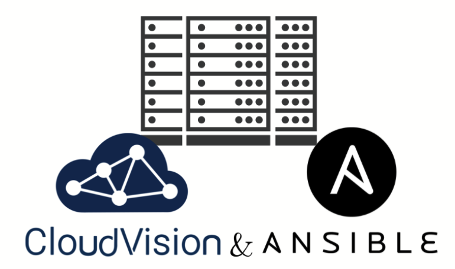
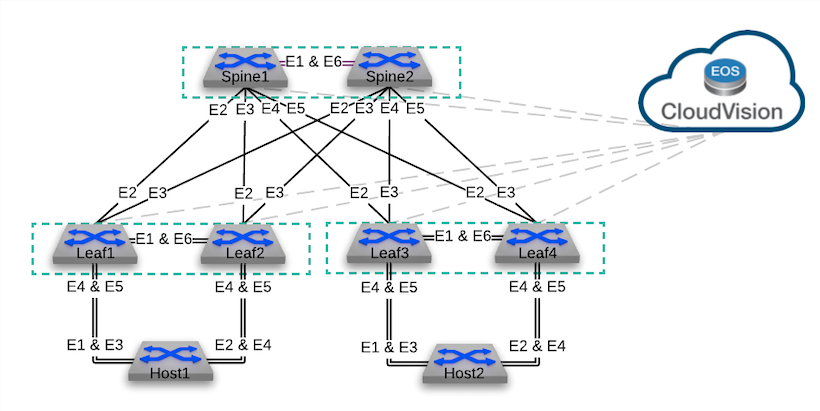

# AVD Arista Validated Design for Arista Test Drive

 

## About

This repository is configured to run [`arista.cvp`](https://github.com/aristanetworks/ansible-cvp) & [`arista.avd`](https://github.com/aristanetworks/ansible-avd) Ansible collections against the Arista Test Drive (ATD) single data center topology.

  

To access an ATD topology, please get in touch with your Arista representative.

## Lab topology

The diagram below shows that the ATD lab topology has two data centers. We will only leverage DC1 in this example.

  

## ATD topology device list

| Device    | IP Address   |
| --------- | ------------ |
| s1-spine1 | 192.168.0.10 |
| s1-spine2 | 192.168.0.11 |
| s1-leaf1  | 192.168.0.12 |
| s1-leaf2  | 192.168.0.13 |
| s1-leaf3  | 192.168.0.14 |
| s1-leaf4  | 192.168.0.15 |
| s1-host1  | 192.168.0.16 |
| s1-host2  | 192.168.0.17 |

> Current repository is built with cEOS management interface (`Management0`). If you run a vEOS topology, please update `mgmt_interface` field to `Management1` in the [ATD_LAB](./atd-inventory/group_vars/ATD_LAB.yml) `group_vars`.

## Step-by-step walkthroughs

- [AVD with Arista Test Drive (ATD)](./DEMO.md)
- [AVD and Ansible Automation Platform (AAP)](./AAP.md)

## Resources

- [Arista Ansible AVD Collection](https://github.com/aristanetworks/ansible-avd)
- [Arista CloudVision Collection](https://github.com/aristanetworks/ansible-cvp)
- [Arista AVD documentation](https://avd.arista.com)

## License

This Project is published under Apache License.
